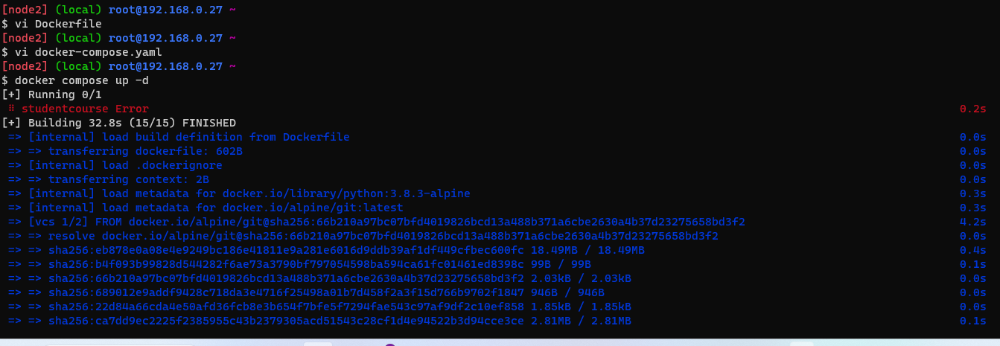

### Create a Multistage dockerfile to build nopcommerce , spring-petclinic, Students-course Registry 
----------------------------------------------------
### Nopcommerce
----------------
Create a ec2 machine 

` sudo apt update `

` curl -fsSL https://get.docker.com -o get-docker.sh `

` sudo sh get-docker.sh `

` sudo usermod -aG docker ubuntu `

` exit `

` re-login `
 
` docker info `

` vi Dockerfile `


FROM ubuntu:22.04 As builder
RUN apt update && apt install unzip -y
ADD https://github.com/nopSolutions/nopCommerce/releases/download/release-4.40.2/nopCommerce_4.40.2_NoSource_linux_x64.zip /nop/nopCommerce_4.40.2_NoSource_linux_x64.zip
RUN cd nop && unzip nopCommerce_4.40.2_NoSource_linux_x64.zip && rm nopCommerce_4.40.2_NoSource_linux_x64.zip


FROM mcr.microsoft.com/dotnet/sdk:7.0
LABEL author="raji" organization="qt" project="learning"
COPY --from=builder /nop /nop-bin
WORKDIR /nop-bin
EXPOSE 5000
CMD [ "dotnet", "Nop.Web.dll", "--urls", "http://0.0.0.0:5000" ]

`docker image build -t nop .  `

 

` docker image ls `
` docker container run --name nop -d -p 32000:5000 nop `
 

` docker container ls `
` docker image tag nop raji07/rajeshwari-nopcommerce `
` docker image ls `
` docker login `


give docker hub username = raji07     
password - ******* 

` docker push -a raji07/rajeshwari-nopcommerce ` 

Now give aws configure 

     


Push these images to AWS ECR DONE


### Spring-petclinic spring-petclinic, Students-course Registry  

Create a ec2 machine 

` sudo apt update `

` curl -fsSL https://get.docker.com -o get-docker.sh `

` sudo sh get-docker.sh `

` sudo usermod -aG docker ubuntu `

` exit `

` re-login `
 
` docker info `

` mkdir multistage `

` cd multistage `

` vi Dockerfile ` 

FROM alpine/git AS vcs
RUN cd / && git clone https://github.com/spring-projects/spring-petclinic.git && \
    pwd && ls /spring-petclinic

FROM maven:3-amazoncorretto-17 AS builder
COPY --from=vcs /spring-petclinic /spring-petclinic
RUN ls /spring-petclinic 
RUN cd /spring-petclinic && mvn package


FROM amazoncorretto:17-alpine-jdk
LABEL author="raji"
EXPOSE 8080
ARG HOME_DIR=/spc
WORKDIR ${HOME_DIR}
COPY --from=builder /spring-petclinic/target/spring-*.jar ${HOME_DIR}/spring-petclinic.jar
EXPOSE 8080
CMD ["java", "-jar", "spring-petclinic.jar"]

` docker image build -t spc . ` 

 


` docker container run --name spc -d -p 35000:8080 spc `

` docker container ls `

` docker images `
` docker login `


Now lets tag the image and push the image 
` docker image tag student raji07/student:student `

` docker push -a raji07/rajispringpetclinic `
            or 
` docker image push raji07/rajispringpetclinic:spc `

` docker image ls ` 

` docker logout `
Now install the awscli commands for ECR (Elastic container registry) 

` sudo apt install awscli -y `
` aws configure ` 
and check docker version
` docker --version ` 

Login with your Docker ID to push and pull images from Docker Hub.
create a repository in it 


` docker login `

Now get into aws ECR then create a public repository in it 
give ur project name or application name
then configure this below commands in terminal n check ull create a public repo in dockerhub registry so that u can pull your image from that when ever u required that repo we can use it 
` aws ecr-public get-login-password --region us-east-1 | docker login --username AWS --password-stdin public.ecr.aws/o5v9d0f6 `
` docker build -t springpetclinic . `
` docker tag springpetclinic:latest public.ecr.aws/o5v9d0f6/springpetclinic:latest `
` docker push public.ecr.aws/o5v9d0f6/springpetclinic:latest `
` docker image ls ` 
` docker container ls ` 


 


### Students-course Registry 
-----------------------------

Dockerfile
---------- 
```docker

FROM alpine/git AS vcs
RUN cd / && git clone https://github.com/DevProjectsForDevOps/StudentCoursesRestAPI.git && \
    pwd && ls /StudentCoursesRestAPI
FROM python:3.8.3-alpine As Builder
LABEL author="raji" organization="qt" project="learning"
COPY --from=vcs /StudentCoursesRestAPI /StudentCoursesRestAPI
ARG DIRECTORY=StudentCourses
RUN cd / StudentCoursesRestAPI cp requirements.txt /StudentCourses
ADD . ${DIRECTORY}
EXPOSE 8080
WORKDIR StudentCoursesRestAPI
RUN pip install --upgrade pip
RUN pip install -r requirements.txt
ENTRYPOINT ["python", "app.py"]

```

Create a ec2 machine 

` sudo apt update `

` curl -fsSL https://get.docker.com -o get-docker.sh `

` sudo sh get-docker.sh `

` sudo usermod -aG docker ubuntu `

` exit `

` re-login `
 
` docker info `

` mkdir multistage `

` cd multistage `

` vi Dockerfile `

` docker image build -t student . ` 

` docker container run --name student -d -p 35000:8080 student `


Now get into the docker hub account login then create a repository of public application then tag the image to terminal

` docker image tag student raji07/student:student `

 ` docker push raji07/student:student ` 

Now get into the AWS account and go to ECR page and create a repostiory then click on the public repository which we created ex student course registry then view push commands so that we will get the following commands  execute that comands in the terminal

these are created by aws itself
` aws ecr-public get-login-password --region us-east-1 | docker login --username AWS --password-stdin public.ecr.aws/o5v9d0f6 `
` docker build -t student-course-registry . `
` docker tag student-course-registry:latest public.ecr.aws/o5v9d0f6/student-course-registry:latest `
` docker push public.ecr.aws/o5v9d0f6/student-course-registry:latest ` 
` docker container ls ` 
` docker image ls ` 
Check the port which u have given 35000:8080


  


### 3) Write a docker compose file for

### a) Nop Commerce: Multistage & docker composefile
-----------------------------------------------------
```docker

FROM ubuntu:22.04 As builder
RUN apt update && apt install unzip -y
ADD https://github.com/nopSolutions/nopCommerce/releases/download/release-4.40.2/nopCommerce_4.40.2_NoSource_linux_x64.zip /nop/nopCommerce_4.40.2_NoSource_linux_x64.zip
RUN cd nop && unzip nopCommerce_4.40.2_NoSource_linux_x64.zip && rm nopCommerce_4.40.2_NoSource_linux_x64.zip


FROM mcr.microsoft.com/dotnet/sdk:7.0
LABEL author="raji" organization="qt" project="learning"
COPY --from=builder /nop /nop-bin
WORKDIR /nop-bin
EXPOSE 5000
CMD [ "dotnet", "Nop.Web.dll", "--urls", "http://0.0.0.0:5000" ]
```
Docker-composefile
------------------- 
```yaml
version: "3.9"
services:
  nop:
    build:
      context: .
      dockerfile: Dockerfile
    networks:
      - nop-net
    ports:
      - "35000:5000"
    depends_on:
      - nop-db

  nop-db:
    image: mysql:8
    networks:
      - nop-net
    volumes:
      - nop-db:/var/lib/mysql
    environment:
      - MYSQL_ROOT_PASSWORD=rootroot
      - MYSQL_USER=nop
      - MYSQL_PASSWORD=rootroot
      - MYSQL_DATABASE=nop
volumes:
  nop-db:
networks:
  nop-net: 
``` 


-------------------------------------------------
### b) Springpet-clinic Multistage file and dockercomposefile 

Docker composefile for springboot 
Dockerfile:
-----------
```docker
FROM alpine/git AS vcs
RUN cd / && git clone https://github.com/spring-projects/spring-petclinic.git && \
    pwd && ls /spring-petclinic

FROM maven:3-amazoncorretto-17 AS builder
COPY --from=vcs /spring-petclinic /spring-petclinic
RUN ls /spring-petclinic 
RUN cd /spring-petclinic && mvn package

FROM amazoncorretto:17-alpine-jdk
LABEL author="raji"
EXPOSE 8080
ARG HOME_DIR=/spc
WORKDIR ${HOME_DIR}
COPY --from=builder /spring-petclinic/target/spring-*.jar ${HOME_DIR}/spring-petclinic.jar
EXPOSE 8080
CMD ["java", "-jar", "spring-petclinic.jar"]
```

```yaml
---
version: "3.9"
services: 
  springpet :
    build :
      context: .
      dockerfile: Dockerfile
    image: spc:3.0.0
​
  springboot:
    image: spc:3.0.0
    container_name: springboot
    networks:
      - spring-net
    volumes:
      - spring-db:/var/lib/mysql
    ports:
      - "8080:8080"  
volumes:
   spring-db:  
networks:
   spring-net: 
```


### c) Game of life Multistage file and dockercomposefile:
-------------------------------------------------------
docker compose file ` docker compose up -d ` use this command to execute of build and run the command 

```docker
## stage-1
FROM tomcat:9-jdk8 as gol
LABEL author="raji" organization="qt"
ARG GOL_URL=https://referenceapplicationskhaja.s3.us-west-2.amazonaws.com/gameoflife.war
ADD ${GOL_URL} /usr/local/tomcat/webapps/gameoflife.war
RUN apt update && apt install unzip -y
RUN unzip /usr/local/tomcat/webapps/gameoflife.war
VOLUME "/usr/local/tomcat"
## stage-2
FROM tomcat:9.0
LABEL author="raji" organization="khaja.tech"
COPY --from=gol /usr/local/tomcat/webapps/ /usr/local/tomcat/webapps/
EXPOSE 8080
CMD ["catalina.sh","run"]
```
### docker composefile:
```yaml
---
version: "3.9"
services:
  gameoflife: 
    build: 
      context: .
      dockerfile: Dockerfile
    ports:
      - "30000:8080"
    image: gol  
```
After build and run check the port


### d) StudentCoursesRestAPI:Multistage file and dockercomposefile:
------------------------------------------------------------------
docker compose file ` docker compose up -d ` use this command to execute of build and run the command  

```docker
FROM alpine/git AS vcs
RUN cd / && git clone https://github.com/DevProjectsForDevOps/StudentCoursesRestAPI.git && \
    pwd && ls /StudentCoursesRestAPI
FROM python:3.8.3-alpine As Builder
LABEL author="raji" organization="qt" project="learning"
COPY --from=vcs /StudentCoursesRestAPI /StudentCoursesRestAPI
ARG DIRECTORY=StudentCourses
RUN cd / StudentCoursesRestAPI cp requirements.txt /StudentCourses
ADD . ${DIRECTORY}
EXPOSE 8080
WORKDIR StudentCoursesRestAPI
RUN pip install --upgrade pip
RUN pip install -r requirements.txt
ENTRYPOINT ["python", "app.py"] 
```

docker compose file:
 -------------------
```yaml
---
version: "3.9"
services:
  studentcourse :
    build :
      context: .
      dockerfile: Dockerfile
    ports:
      - "30000:8080"
    image: scr
``` 

 
 


